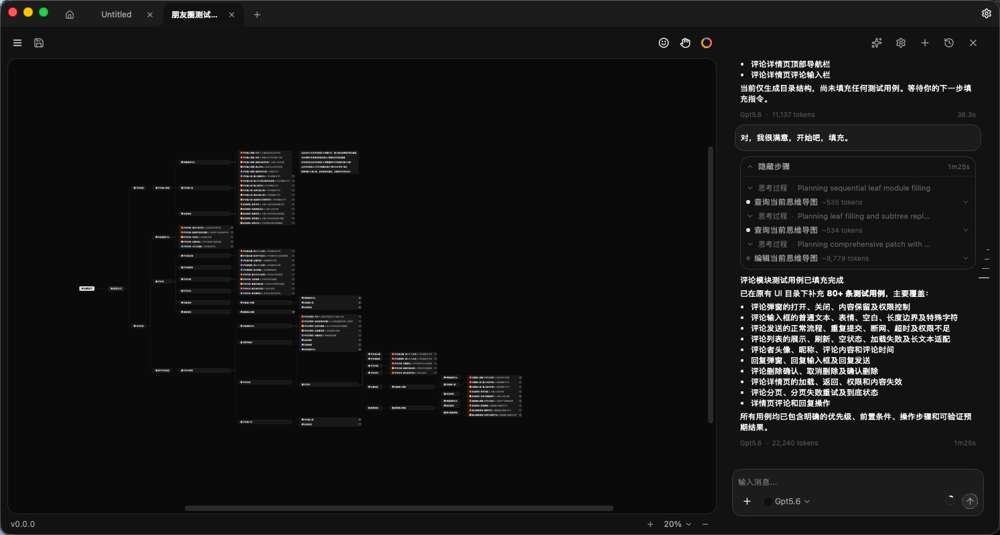
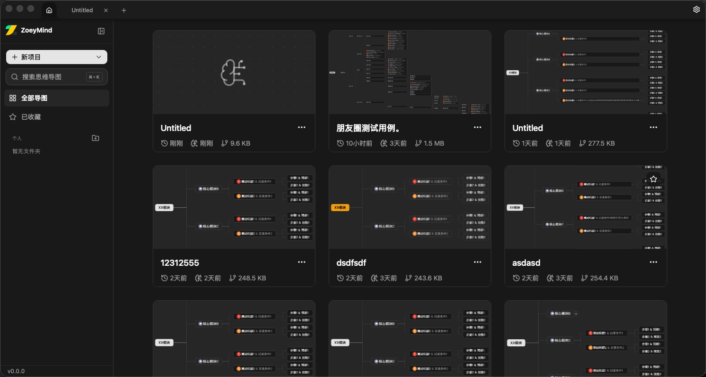
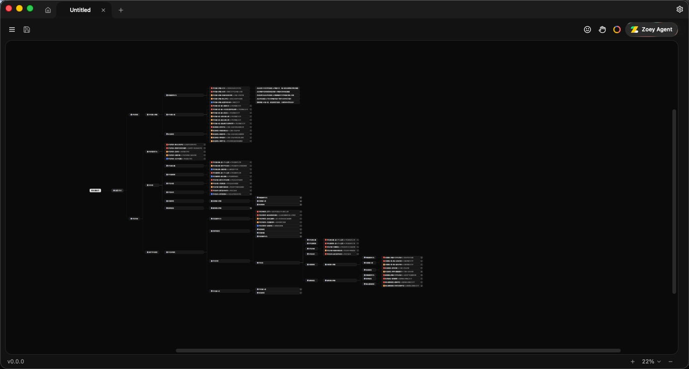
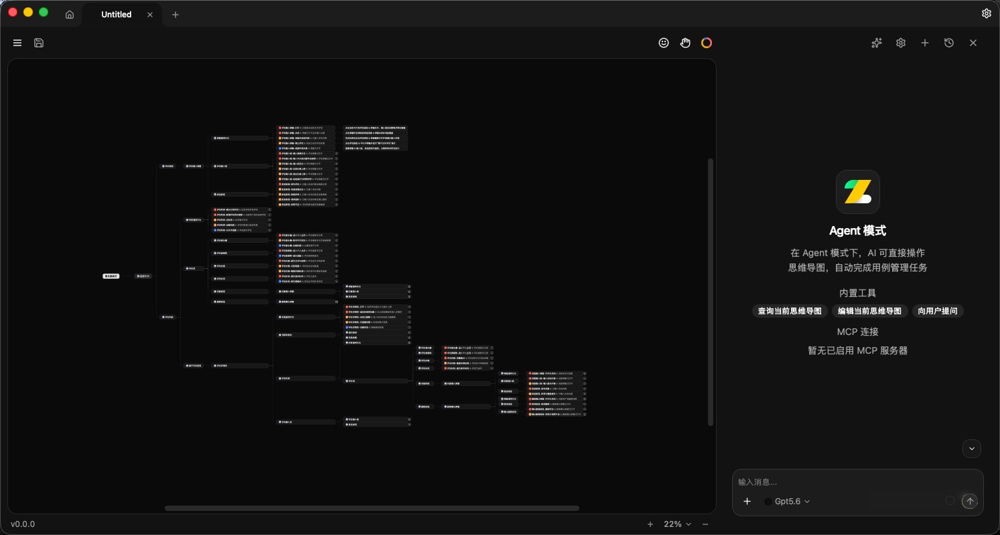

<p align="center">
  
</p>

<h1 align="center">ZoeyMind Desktop</h1>

<p align="center">
  面向测试人员的<b>功能测试用例编辑器</b> · 思维导图 × AI Agent
</p>

<p align="center">
  <a href="https://github.com/zoeymind/zoeymind-desktop/releases/latest"></a>
  <a href="https://www.npmjs.com/package/@zoeymind/cli"></a>
  <a href="https://www.npmjs.com/package/@zoeymind/mcp"></a>
  <a href="./LICENSE"></a>
</p>

<p align="center">
  <a href="https://zoeymind.com">Website</a> ·
  <a href="https://github.com/zoeymind/zoeymind-desktop/releases/latest">Download</a> ·
  <a href="https://zoeymind.com/changelog">Changelog</a> ·
  <a href="./README.en.md">English</a>
</p>

<hr />

<p align="center">
  
</p>

ZoeyMind Desktop 是一款面向测试人员的**功能测试用例编辑器**。它用思维导图组织用例，让 AI Agent 帮你把用例写完，并与团队现有的 XMind / MeterSphere 流程双向流通。

**三条差异化**：

- 🛡 **完全本地化**：`.zmind` 文件保存在你自己磁盘任意路径。无云、无账号、不用注册、不用登录，用例数据永远不出本机。
- 🔑 **AI 完全 BYOK**：用你自己的 OpenAI / Anthropic / Gemini / Ollama Key，模型选你相信的，费用在你自己账单里。ZoeyMind 不代理、不转发、不缓存。
- 🔁 **XMind × MeterSphere 双向流通**：导入团队现有 `.xmind`、导出 MeterSphere 用例格式，剪贴板与 XMind / 飞书思维导图互通。

## 截图

<table>
  <tr>
    <td width="33%"><a href="./.github/assets/library.jpeg"></a><br><sub><b>用例库</b> — 每个 <code>.zmind</code> 对应一个模块或项目</sub></td>
    <td width="33%"><a href="./.github/assets/canvas-overview.jpeg"></a><br><sub><b>用例总览</b> — 模块 → 用例 → 步骤三层结构</sub></td>
    <td width="33%"><a href="./.github/assets/agent-mode.jpeg"></a><br><sub><b>AI Agent 模式</b> — 内置工具 + 可选 MCP</sub></td>
  </tr>
</table>

## 功能

**测试用例专用结构**

- 模块 / 用例 / 前置条件 / 步骤 / 预期结果 都是一等公民节点，不是靠标签硬撑；
- 用例优先级（P0 / P1 / P2 / P3）、标签、图标、缺陷关联；
- 大文档高性能模式，2000+ 节点仍顺滑；
- 撤销/重做、多标签、崩溃恢复、外部改动检测。

**AI Agent（BYOK）**

- 内置 Mind AI Agent，从需求文本或已有骨架产出结构化用例：边界、异常、权限、数据校验；
- 支持 OpenAI · OpenAI 兼容 (Groq / DeepSeek / Kimi 等) · Anthropic · Google Gemini · Ollama（本地模型）；
- 可选人机双确认「编辑审查」：Agent 提交编辑前先看 diff；
- 可挂外部 MCP Server 扩展工具（Desktop 同时也是 MCP Host）。

**互通与迁移**

- 导入：标准 XMind、MeterSphere XMind、Markdown、嵌套 ZIP；
- 导出：MeterSphere XMind、标准 XMind、PDF / PNG / SVG / Markdown / JSON / TXT / ZIP；
- 剪贴板兼容 XMind、飞书思维导图。

**外部自动化（可选）**

- [`@zoeymind/cli`](https://www.npmjs.com/package/@zoeymind/cli)：命令 `zoeymind`，脚本/本地工具驱动 Desktop；
- [`@zoeymind/mcp`](https://www.npmjs.com/package/@zoeymind/mcp)：stdio MCP server，把 Desktop 暴露给 Claude Code / OMP / Codex / OpenCode；
- 默认关闭；启用需要在 Preferences 里显式开启，破坏性编辑权限单独控制；
- 通信走本地 authenticated loopback，每次启动新 token，不监听公网端口。

**系统与格式**

- macOS（Intel + Apple Silicon）、Windows x64、Linux（`.AppImage` / `.deb`）原生构建；
- 自动更新走 Tauri Updater；
- 主题预设 + 深浅色，中英文界面。

## 安装

```bash
# 桌面应用（推荐）
# 前往 GitHub Releases 下载对应平台安装包
# https://github.com/zoeymind/zoeymind-desktop/releases/latest

# 命令行 / MCP（按需）
npm install -g @zoeymind/cli
npm install -g @zoeymind/mcp
```

MCP Host 配置：

```json
{
  "mcpServers": {
    "zoeymind": { "command": "zoeymind-mcp" }
  }
}
```

**首次运行**：ZoeyMind 未购买 Apple / Microsoft 代码签名证书，OS 会问一次是否放行。

- **macOS**：`.dmg` 拖入 Applications 后，在 Launchpad 右键 ZoeyMind → 打开 → 弹出「无法确认开发者」时点「打开」；或 系统设置 → 隐私与安全性 → 找到 ZoeyMind → 仍要打开。之后不再询问。
- **Windows**：SmartScreen 弹出「Windows 已保护你的电脑」时，点顶部小字「更多信息」→「仍要运行」。之后不再询问。
- **Linux**：AppImage 加执行权限 `chmod +x` 即可运行；`.deb` 用 `sudo apt install ./ZoeyMind_*.deb`。

> 应用内部使用 Tauri Updater 的加密签名校验更新完整性，独立于 OS 代码签名。

## 本地开发

```bash
pnpm install
pnpm tauri:dev
```

CLI/MCP、Portal、Broker、native 完整验收命令见 [`RELEASE.md`](./RELEASE.md)。

## 反馈与安全

- **一般反馈**：<https://github.com/zoeymind/zoeymind-desktop/issues>
- **商业授权**：<1103837067@qq.com>
- **安全漏洞**：GitHub 私有漏洞报告或上述邮件，详见 [`SECURITY.md`](./SECURITY.md)

## License

Apache License 2.0。允许自由使用、修改、商用与再分发；只需保留 [`LICENSE`](./LICENSE) 与 [`NOTICE`](./NOTICE)，并在源码中保留归属声明。

Copyright © 2026 ZoeyMind. Maintained by [@chacelow](https://github.com/chacelow).
