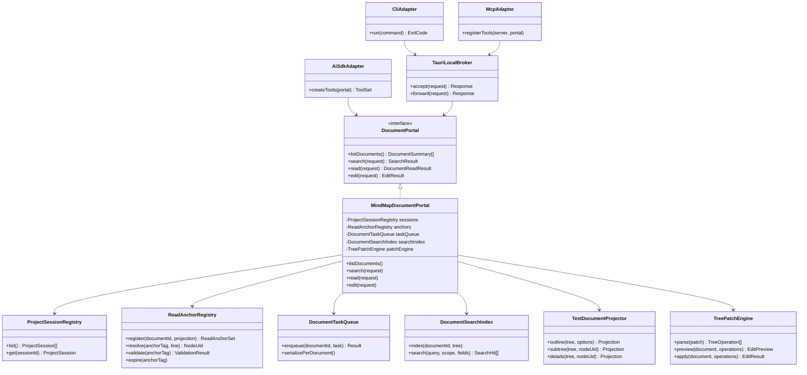
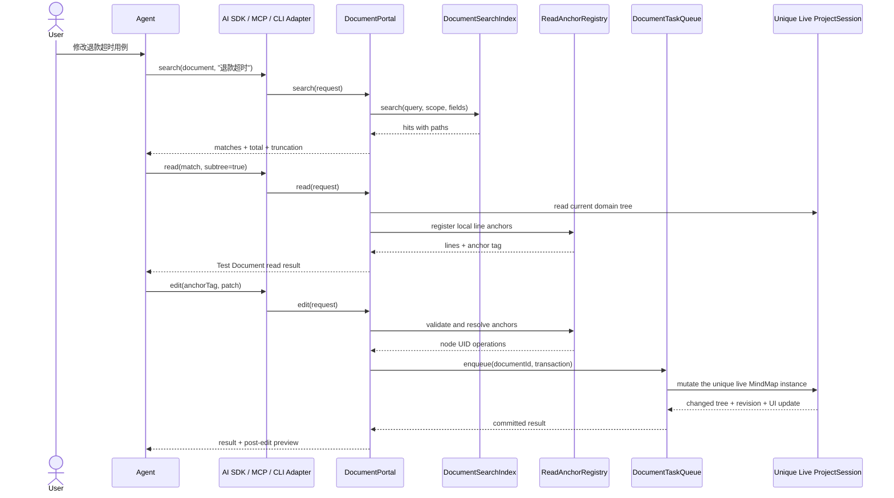

# 文档自动化 Portal Epic

- 状态：方案确定，待实施
- 最近更新：2026-08-21
- 适用范围：ZoeyMind Desktop
- 稳定术语：[Desktop Context](../../CONTEXT.md)

## 1. 最终目标

ZoeyMind 提供一套统一的文档自动化能力，让以下调用方使用同一套文档读取与编辑语义：

- 桌面端内置 AI Chat；
- ZoeyMind CLI；
- 通过 MCP 接入的 Claude Code、Codex、OpenCode、OMP 等本地 Agent。

Portal 是文档自动化内核，不是某个 Agent 的 Adapter。AI SDK、CLI 和 MCP 只负责协议转换，不实现各自的模块或测试用例 CRUD。

第一阶段只操作当前已经打开且 ready 的文档标签。未打开文档的后台加载与保存不属于本 Epic。

## 2. 最终使用形式

测试项目在 Agent 面前表现为一份可搜索、可局部读取、可打补丁的 Test Document。每个已打开文档只有一个 `ProjectSession` 和一个实时 MindMap 实例，它们是唯一数据源；内部继续保留稳定节点 UID、样式、图标、布局和保存状态。所有 Portal 写操作进入该文档自己的串行任务队列，并直接修改这个实时实例，画布随每次提交立即更新。

```text
[电商测试/订单/退款#7C21]
1: # 退款
2:   # 原路退款
3:     [P1] 用户申请原路退款 & 订单已支付
4:       点击申请退款 & 显示退款确认弹窗
5:       确认退款 & 订单进入退款处理中
6:     [P2] 退款接口处理超时
7:       提交退款申请 & 页面显示处理中
8:       等待超过 30 秒 & 系统主动查询退款结果
```

Agent 不接触节点 UID，不生成完整思维导图 JSON，也不学习 ZTDL。它只执行以下流程：

```text
documents → search → read → edit
```

编辑采用带快照校验的树形 Hashline Patch：

```text
[电商测试/订单/退款#7C21]

PUT 8.=8:
+      等待超过 30 秒 & 系统主动查询退款结果并保持订单为退款处理中

PUT >8:
+      查询成功 & 页面展示最终退款状态
```

行号只属于当前局部读取结果。`ReadAnchorRegistry` 仅短期记录“Agent 看到的行号 → 真实节点 UID → 当时内容 hash”，不是文档副本、持久化快照或第二数据源。Portal 校验锚点后，将修改提交到唯一的实时 `ProjectSession`；同一文档串行执行，不同文档使用独立队列，并在一次事务内完成修改、undo、dirty、布局和实时画布更新。

## 3. 最终架构



### 调用时序



## 4. Portal Interface

Portal 对所有 Adapter 只暴露四个操作。

### `documents`

列出当前打开的文档标签。

```text
1. 电商测试    active ready dirty  R218
2. 用户中心    ready clean          R37
```

每个结果包含稳定的文档会话身份、标题、ready、dirty、active 和 revision。外部写操作必须显式绑定文档，不能随 UI 活动标签变化而漂移。

### `search`

在领域树索引上搜索，不先序列化整篇 Test Document。

输入包括：

- document；
- query；
- 可选 scope；
- fields：模块、用例名、前置条件、操作、预期；
- mode：exact 或 hybrid；
- limit 和 cursor。

返回必须包含路径、命中字段、总命中数、当前返回数和是否截断。

### `read`

按需生成 Test Document 投影：

- `outline`：模块目录和用例数量；
- `summary`：指定模块的确定性统计；
- `subtree`：指定节点及其后代；
- `details`：少量用例的完整字段。

只有实际返回给 Agent 的局部窗口注册行锚点并生成短期 anchor tag。

### `edit`

接收 anchor tag 和 Tree Hashline Patch。第一版支持：

```text
PUT N.=M:   替换节点或连续节点
PUT N*:     替换节点及其完整子树
PUT <N:     在节点前插入同级节点
PUT >N:     在节点后插入同级节点
PUT >N*:    在子树后插入同级节点
CUT N*      删除并捕获完整子树
PUT >N @x   粘贴已捕获子树
MOVE N* >M  移动完整子树
```

Patch 中缩进表达树层级：

- `# 名称`：模块；
- `[P1]`、`[P2]`、`[P3]`：测试用例；
- 用例子行：测试步骤；
- 用例名中的 `&`：前置条件；
- 步骤中的 `&`：操作与预期结果。

## 5. 大文档处理

3000 条用例、近万行内容仍是一个逻辑 Test Document，但不会整篇注入模型上下文。


固定规则：

1. 默认先返回模块目录，不返回全文；
2. 搜索在结构化字段索引上运行；
3. 只渲染命中节点周围或指定子树；
4. Agent 的结论必须保留 scope、命中总数和截断状态；
5. 全局分析按模块分块，Portal 确定性记录扫描覆盖率；
6. 大批量修改按模块分事务，并先返回 preview；
7. anchor 过期或目标内容已变化时拒绝修改，不根据旧行号猜测目标。

## 6. 编辑不变量

`DocumentPortal.edit` 必须统一保证：

1. Agent 不接触或提交内部节点 UID；
2. 每次编辑绑定明确的 document 和 read anchor；
3. 所有锚点必须来自 Agent 已读取的可见范围；
4. 一个 Patch 对一个文档原子执行；
5. 一个 Patch 形成一个 undo entry；
6. 修改成功后统一标记 dirty；
7. 写操作按文档串行，不同文档拥有独立队列；
8. 禁止形成树循环或移动到自身后代；
9. 删除模块必须计算完整级联影响；
10. 节点类型、父子关系、优先级和步骤格式必须校验；
11. no-op、重叠操作、越界锚点和歧义恢复必须失败；
12. 返回新的 revision、anchor tag 和受影响区域预览。

## 7. 最终代码布局

以下路径是本 Epic 的目标布局：

```text
apps/web/src/products/mind/document-portal/
├── document-portal.ts              # 唯一公开 interface 与请求/结果类型
├── mindmap-document-portal.ts      # ProjectSession / MindMap adapter
├── test-document-projector.ts      # 领域树 → Test Document
├── read-anchor-registry.ts         # 短期行锚点、UID 映射、内容 hash 与过期回收
├── document-search-index.ts        # 字段索引、scope、分页与命中证据
├── tree-patch/
│   ├── grammar.ts                  # Patch 语法
│   ├── parser.ts                   # 文本 → TreeOperation
│   ├── validator.ts                # 树结构和领域规则校验
│   └── apply.ts                    # preview 与原子应用
└── adapters/
    └── ai-sdk.ts                   # 内置 AI Chat tools

apps/web/src/products/mind/x/ai-chat/
└── ...                             # 迁移为 Portal caller；删除模型可见 ZTDL 与重复 CRUD

src-tauri/src/document_portal/
├── mod.rs                          # 本地 Broker 生命周期
├── transport.rs                    # UDS / named pipe 或安全 loopback transport
└── auth.rs                         # 本机连接 token 与请求授权

apps/cli/
└── src/                            # documents/search/read/edit CLI adapter

apps/mcp/
└── src/                            # MCP stdio shim 与四个 Portal tools
```

共享协议类型只保留一份。AI SDK、CLI 和 MCP 不复制领域编辑逻辑。

## 8. 迁移结果

迁移完成后的唯一数据路径：

```text
AI request
→ documents/search/read/edit
→ DocumentPortal
→ ProjectSession domain tree
→ undo + dirty + layout + save lifecycle
```

现有 ZTDL 的处理结果：

- 删除系统提示中的 ZTDL 协议；
- 删除模型可见的 `M:`、`C:` 和短 ID；
- 删除 CRUD 工具自行拼接的 ZTDL 返回；
- 删除 `ztdlAdd`、`ztdlRemove`、`ztdlModify`、`ztdlMove`、`ztdlCopy`；
- 消息中的节点跳转改用结构化 UI metadata，不解析模型文本中的 ZTDL；
- `MindmapContextManager` 改为通过 Portal 生成 outline、search result 和局部读取结果；
- 原有多个模块/用例 CRUD 工具在调用方全部迁移后删除。

## 9. 实施阶段

### 阶段 A：Portal 内核

建立 `DocumentPortal`、Test Document 投影、短期 read anchor、每文档任务队列、精确搜索和 Tree Patch。现有 AI Chat 先通过 AI SDK Adapter 使用新接口。

### 阶段 B：ZTDL 清理

迁移上下文、工具返回、消息渲染和压缩逻辑；删除模型可见 ZTDL、Session 短 ID 和重复 CRUD 工具。

### 阶段 C：本地 Broker 与 CLI

由 Tauri 托管本机 Broker。CLI 作为第一个跨进程参考客户端，验证应用未启动、文档未 ready、标签关闭、anchor 失效和重连行为。

### 阶段 D：MCP

使用官方 MCP SDK注册 `documents`、`search`、`read`、`edit`，通过 stdio shim 转发到本地 Broker。Claude Code、Codex、OpenCode 和 OMP 使用相同 MCP Server。

## 10. 验收标准

1. 内置 AI Chat 不再接收或生成 ZTDL；
2. Agent 完成模块与用例增删改移时不提交节点 UID；
3. 同一套四操作 Interface 同时驱动 AI SDK、CLI 和 MCP；
4. 3000 条用例样本不会默认完整进入模型上下文；
5. 精确搜索结果包含路径、总数、截断状态和字段来源；
6. 局部 read 返回可编辑行锚点，edit 只能引用已读取范围；
7. 用户在 read 与 edit 之间修改目标节点时，旧 anchor 不会静默覆盖实时内容；
8. 子树删除和移动保持树结构合法，并生成一个 undo entry；
9. Patch 部分失败时不留下半完成修改；
10. 修改成功后 dirty、布局、保存与恢复生命周期保持一致；
11. 两个文档可独立排队修改，不共享全局写队列；
12. CLI 与 MCP 在桌面应用未运行或目标标签未 ready 时返回明确错误；
13. 完成真实样本基准：搜索召回、目标定位、Patch 首次成功率、错误修改率和 token 使用量均有可重复记录。

## 11. 不属于本 Epic

- 未打开 `.zmind` 文档的后台编辑；
- 多 Agent 实时协同编辑；
- 云端 Portal；
- MCP Resources 和 subscriptions；
- 默认启用的全文向量索引；
- 跨文档原子事务；
- 自动绕过 destructive preview；
- 将 Test Document 作为新的持久化文件格式。

Test Document 只作为 Agent Interface。`.zmind` 和文档会话的领域树仍是正式数据源。
