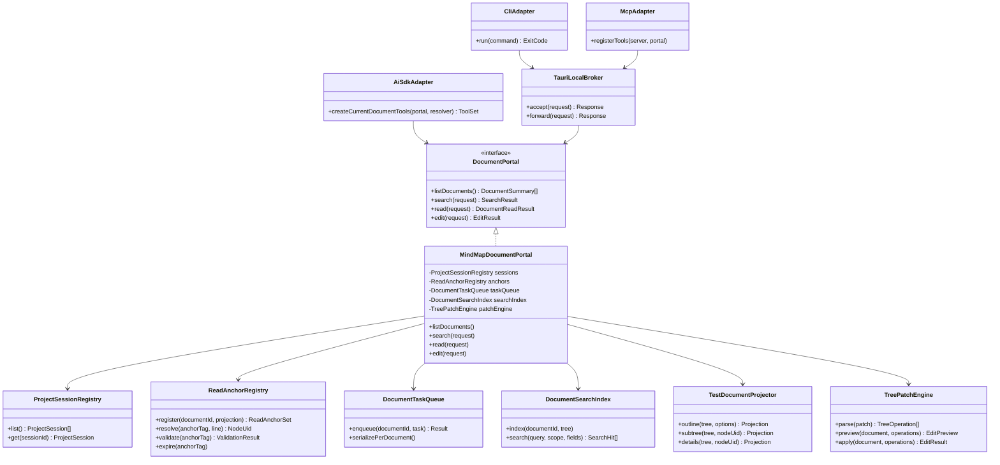
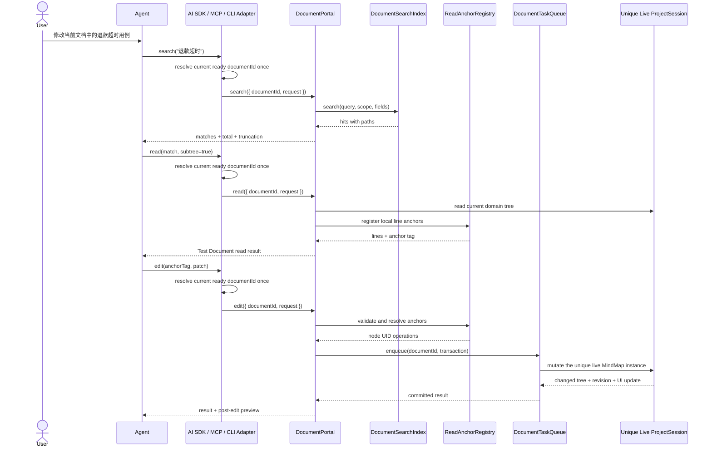
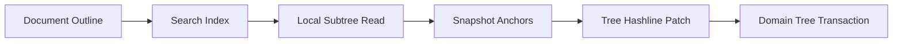

# 文档自动化 Portal Epic

- 状态：已实现；CLI/MCP release artifacts 和发布工作流已完成
- 最近更新：2026-08-22
- 适用范围：ZoeyMind Desktop
- 稳定术语：[CONTEXT.md](../../CONTEXT.md)

## 1. 最终目标

ZoeyMind 提供一套统一的文档自动化能力，让以下调用方使用同一套文档读取与编辑语义：

- 桌面端内置 AI Chat；
- ZoeyMind CLI；
- 通过 MCP 接入的 Claude Code、Codex、OpenCode、OMP 等本地 Agent。

Portal 是文档自动化内核，不是某个 Agent 的 Adapter。AI SDK、CLI 和 MCP 只负责协议转换，不实现各自的模块或测试用例 CRUD。

第一阶段操作当前已经打开且 ready 的文档标签。未打开文档的后台无界面加载与保存不属于本 Epic。

外部 CLI 与 MCP Adapter 暴露 `projects`、`activate_project`、`query_current_mindmap`、`edit_current_mindmap`。外部调用方先控制活动项目，随后 query/edit 在每次调用开始时解析当前 ready 的 `ProjectSession`。内置 AI Chat 不暴露项目控制，只暴露当前导图 query/edit，并使用同一个 Portal 内核。内部文档身份、节点 UID 和编辑审查 token 均不进入模型输入。

## MCP 配置

先启动 ZoeyMind Desktop 并等待目标文档 ready。MCP server 是无状态 stdio Adapter；每次工具调用都会重新读取本机 Broker descriptor，不保存 Broker port 或 token。

正式发行名称：

```text
npm package: @zoeymind/mcp
executable:  zoeymind-mcp
server key:  zoeymind
```

发布后的标准配置：

```json
{
  "mcpServers": {
    "zoeymind": {
      "command": "zoeymind-mcp",
      "args": []
    }
  }
}
```

开发工作区使用：

```json
{
  "mcpServers": {
    "zoeymind": {
      "command": "pnpm",
      "args": [
        "--dir",
        "/absolute/path/to/apps/desktop",
        "--filter",
        "@zoeymind/mcp",
        "exec",
        "tsx",
        "src/index.ts"
      ]
    }
  }
}
```

MCP Host 与 Adapter 通过 stdio JSON-RPC 通信；Adapter 再通过 authenticated dynamic loopback HTTP 调用 Desktop Broker。MCP Adapter 本身不监听端口。`query_current_mindmap` 为只读工具；`edit_current_mindmap` 是 destructive、非幂等写操作，必须使用 query 返回的 anchor。应用不可用、文档未 ready/已关闭或 anchor 冲突时，工具返回保留 Broker `errorCode` 的 MCP `isError` response。

兼容与授权策略：npm packages 要求 Node.js 22+，descriptor protocol 当前为 version 1，未知版本 fail closed。Desktop 启动时创建只监听 `127.0.0.1` 的 Broker 和权限受限 descriptor，每次启动生成新 token；本机 CLI/MCP 通过该 token 查询和编辑当前文档。`preview: true` 只计算影响，绝不提交；内置 AI 的编辑审查流程与外部 Adapter 相互独立。

## 2. 最终使用形式

测试项目在 Agent 面前表现为一份可搜索、可局部读取、可打补丁的 Test Document。每个已打开文档只有一个 `ProjectSession` 和一个实时 MindMap 实例，它们是唯一数据源；内部继续保留稳定节点 UID、样式、图标、布局和保存状态。所有 Portal 写操作进入该文档自己的串行任务队列，并直接修改这个实时实例，画布随每次提交立即更新。

```text
[电商测试/订单/退款#7C21]
1: # 退款
2:   # 原路退款
3:     [P1] 用户申请原路退款 & 订单已支付
4:       点击申请退款 & 显示退款确认弹窗
5:       确认退款 & 订单进入退款处理中
6:     [P2] 退款接口处理超时
7:       提交退款申请 & 页面显示处理中
8:       等待超过 30 秒 & 系统主动查询退款结果
```

Agent 不接触节点 UID，不生成完整思维导图 JSON，也不学习 ZTDL。外部 Agent 执行：

```text
projects → activate_project → query_current_mindmap → edit_current_mindmap
```

项目已经处于正确活动状态时，可直接从 query 开始。内置 Agent 只有 query/edit/question。

编辑采用带快照校验的树形 Hashline Patch：

```text
[电商测试/订单/退款#7C21]

PUT 8.=8:
+      等待超过 30 秒 & 系统主动查询退款结果并保持订单为退款处理中

PUT >8:
+      查询成功 & 页面展示最终退款状态
```

行号只属于当前局部读取结果。`ReadAnchorRegistry` 仅短期记录“Agent 看到的行号 → 真实节点 UID → 当时内容 hash”，不是文档副本、持久化快照或第二数据源。Portal 校验锚点后，将修改提交到唯一的实时 `ProjectSession`；同一文档串行执行，不同文档使用独立队列，并在一次事务内完成修改、undo、dirty、布局和实时画布更新。

## 3. 最终架构



### 调用时序



## 4. Adapter Interface

### 外部 CLI/MCP

外部 Adapter 暴露四个操作：

- `projects`：列出项目或创建临时草稿；
- `activate_project`：打开或激活一个项目；
- `query_current_mindmap`：使用 `outline`、`subtree` 或 `search` 查询当前导图；
- `edit_current_mindmap`：接收 anchor tag、Tree Hashline Patch 和可选 return view。

### 内置 Agent

内置 Agent 不列出、创建或激活项目，只暴露：

```text
query_current_mindmap
edit_current_mindmap
question
```

### Query

`outline` 返回 root、嵌套模块和用例标题，不返回步骤，`completeness` 为 `structure-only`。`subtree` 返回步骤和预期结果，只有 `truncated: false` 时才能支持完整子树替换。`search` 在结构化字段索引上运行，返回路径、命中字段、总数、分页和截断状态。

只有实际返回给 Agent 的局部窗口注册行锚点。行号映射到内部 UID 和内容 hash，但 UID 不出现在公开结果中。

### Edit

Wire format：

```text
PUT N.=M:       替换节点或连续节点
PUT <N:         在节点前插入同级节点
PUT >N:         在节点后插入同级节点
CUT N.=M:       删除连续节点
MOVE N -> M:    移动子树
```

Patch body 每行以 `+` 开始，两个空格表示一层树深度。`# 名称` 表示模块，`[P1]`/`[P2]`/`[P3]` 表示用例，`&` 分隔用例前置条件或步骤操作/预期。

一个 patch 对一个文档原子执行并形成一个 undo entry。成功后返回 revision、diagnostics、新的 bounded view 和新 anchor；旧 anchor 随提交失效。结构和事务错误整体回滚，内容质量问题以 localized diagnostics 随已提交结果返回。

## 5. 大文档处理

3000 条用例、近万行内容仍是一个逻辑 Test Document，但不会整篇注入模型上下文。



固定规则：

1. 默认先返回模块目录，不返回全文；
2. 搜索在结构化字段索引上运行；
3. 只渲染命中节点周围或指定子树；
4. Agent 的结论必须保留 scope、命中总数和截断状态；
5. 全局分析按模块分块，Portal 确定性记录扫描覆盖率；
6. 大批量修改按模块分事务，并先返回 preview；
7. anchor 过期或目标内容已变化时拒绝修改，不根据旧行号猜测目标。

## 6. 编辑不变量

`DocumentPortal.edit` 必须统一保证：

1. Agent 不接触或提交内部节点 UID；
2. 每次编辑绑定明确的 document 和 read anchor；
3. 所有锚点必须来自 Agent 已读取的可见范围；
4. 一个 Patch 对一个文档原子执行；
5. 一个 Patch 形成一个 undo entry；
6. 修改成功后统一标记 dirty；
7. 写操作按文档串行，不同文档拥有独立队列；
8. 禁止形成树循环或移动到自身后代；
9. 删除模块必须计算完整级联影响；
10. 节点类型、父子关系、优先级和步骤格式必须校验；
11. no-op、重叠操作、越界锚点和歧义恢复必须失败；
12. 返回新的 revision、anchor tag 和受影响区域预览。

## 7. 最终代码布局

以下是当前实现布局：

```text
apps/web/src/products/mind/document-portal/
├── document-portal.ts              # Portal interface 与请求/结果类型
├── mindmap-document-portal.ts      # ProjectSession / MindMap implementation
├── current-document-adapter.ts     # 当前 ready 文档 query/edit seam
├── local-broker-bridge.ts          # Tauri Broker event bridge
├── project-controller.ts           # 外部项目 list/create/activate/discard
├── read-anchor-registry.ts         # 短期行锚点、UID 映射、内容 hash
├── test-document-projector.ts      # 领域树 → bounded Test Document
└── tree-hashline.ts                # grammar、validation、data-tree apply

src-tauri/src/document_portal/mod.rs # 动态 loopback Broker、token、descriptor
packages/document-portal-client/     # Node Broker Client 与 wire tool names
apps/cli/                            # CLI Adapter
apps/mcp/                            # stdio MCP Adapter
```

共享协议类型只保留一份。AI SDK、CLI 和 MCP 不复制领域编辑逻辑。

## 8. 迁移结果

迁移完成后的唯一数据路径：

```text
AI request
→ current-document AI Adapter (documentId injected once per tool call)
→ DocumentPortal
→ ProjectSession domain tree
→ undo + dirty + layout + save lifecycle
```

现有 ZTDL 的处理结果：

- 删除系统提示中的 ZTDL 协议；
- 删除模型可见的 `M:`、`C:` 和短 ID；
- 删除 CRUD 工具自行拼接的 ZTDL 返回；
- 删除 `ztdlAdd`、`ztdlRemove`、`ztdlModify`、`ztdlMove`、`ztdlCopy`；
- 消息中的节点跳转改用结构化 UI metadata，不解析模型文本中的 ZTDL；
- `MindmapContextManager` 改为通过 Portal 生成 outline、search result 和局部读取结果；
- 原有多个模块/用例 CRUD 工具在调用方全部迁移后删除。

## 9. 实施结果

- Portal 内核、bounded projection、structured search、read anchor、per-document queue 和 Tree Hashline Patch 已完成；
- 内置 AI 已迁移到当前导图 query/edit/question，并移除模型可见 ZTDL 和重复 CRUD tools；
- Tauri Local Broker、CLI 实时集成和 stdio MCP Adapter 已完成；
- 3000-case benchmark、真实 MindMap engine tests、live APP/Broker integration 和 Rust Broker tests 已建立；
- npm CLI/MCP 的正式 package build、兼容矩阵、安全控制和发布自动化尚未完成，见仓库根 README。

## 10. 验收结果

1. 内置 AI Chat 不再接收或生成 ZTDL；
2. Agent 完成模块与用例增删改移时不提交节点 UID；
3. 内置 Agent 与外部 CLI/MCP 共用 Portal 内核，Adapter 不复制领域逻辑；
4. 3000 条用例样本不会默认完整进入模型上下文；
5. 搜索结果包含路径、总数、截断状态和字段来源；
6. 局部 query 返回可编辑行锚点，edit 只能引用已读取范围；
7. query 与 edit 之间目标变化时，旧 anchor 不会静默覆盖实时内容；
8. 子树删除和移动保持树结构合法，并生成一个 undo entry；
9. Patch 部分失败时不留下半完成修改；
10. 修改成功后 dirty、布局、保存与恢复生命周期保持一致；
11. 两个文档使用独立写队列；
12. CLI 与 MCP 在应用未运行或标签未 ready 时返回明确错误；
13. 大文档 benchmark 与真实 live integration 可重复运行。

## 11. 不属于本 Epic

- 未打开 `.zmind` 文档的后台编辑；
- 多 Agent 实时协同编辑；
- 云端 Portal；
- MCP Resources 和 subscriptions；
- 默认启用的全文向量索引；
- 跨文档原子事务；
- 外部 Agent 的用户交互式 destructive review；当前外部调用是受信任本地自动化通道，Broker 内部完成 preview/commit；
- 将 Test Document 作为新的持久化文件格式。

Test Document 只作为 Agent Interface。`.zmind` 和文档会话的领域树仍是正式数据源。
